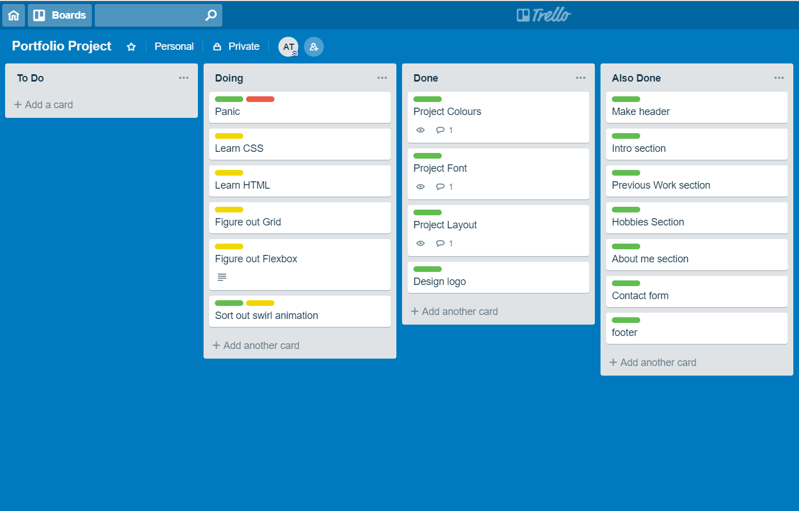

<h1>Portfolio Project</h1>
<h2>By Alex Taylor</h2>

<a href="https://eldritch-solutions.netlify.com"> The website itself</a>

<a href="https://github.com/ATaylor1181/Portfolio"> The Github </a>

<h2>The website itself</h2>

<h3>The purpose </h3>

 I suppose the final purpose of this page is to inform prospective employers and anyone with an interest who I am, and what I can do. 

<h3>Functionality/Features </h3>

 The page in it's initial stages was going to be a series of interlinked html pages each with a different purpose, that idea was postponed and the current form is of a single page with a footer nav bar used to traverse the page should the user not wish to scroll from top to bottom. 

 It's features at present are fairly mundane, mostly grids and cards used to display and differentiate between things. The pride of the page however is the header, the swirling animation leading into my logo took some time to figure out, but I am very pleased with how it's turned out. 

 Future plans for the page include changing it from one page into multiple with an inbuilt gallery so I can show off some of my admittedly amateur photography, that and perhaps some alternate animations, one per page each ending in my logo, but that's a problem for another day. 

<h3> Screenshots</h3>

<h3>Tech Stack</h3>

 So far the technologies used to develop this website were HTML, CSS for the page itself, and  Photoshop for the logo. Special credit goes to Youtube and Google for their invaluable assistance in this endeavor. 

<h2>Planning Process</h2>

The plan for this project initially was to create a website that was a series of interconnected pages with a permanent nav bar linking them all and making navigation simple. The end result was something similar but everything was eventually restricted to one page simply for ease of use. The intent at present is to go back time permitting and shift the website so it more closely resembles the original design, preferably with more functional animation as I found while it does interest me my current skill level and time constraints made my first design both difficult and slightly beyond my grasp. However as one of my favourite quotes goes "No battle plan survives the first volley of arrows", in laymans terms plans work up until the parts start to move. 

 My timeline for this project, like everyone elses was almost a week, in that time I learned that while I may know enough CSS and HTML to get myself in trouble, I seldom knew enough to get myself out. This led to hours spent on Youtube and Google instead of with, as she believes anyway, a thoroughly neglected girlfriend and two angry cats.

 The initial stages of planning involved Figma and a Trello board 

 Which as you can see was fairly well thought out as I set aside plenty of time for panicking (not shown is how much time involved my palm impacting my forehead after realizing whatever was wrong with the website,the world, and possibly original sin, was all because I'd missed a semi colon somewhere.)

<h2>Short answer Q & A </h2>

<h3> Key events in the history of the internet </h3>

The internet has not always been the gargantuan beast we know it as today. It began a long time ago, the 1960's in fact, but that was it's infancy, let's skip forward a little.

While computers were becoming more widely used it wouldn't be until the 1980's that the internet as the average person thinks of it would be born. In 1981 CSNET was created, this allowed computer science networks at various universities to connect and share information. It wouldn't be until 1982 however when TCP/IP was coined that the process would become a much simpler affair.

